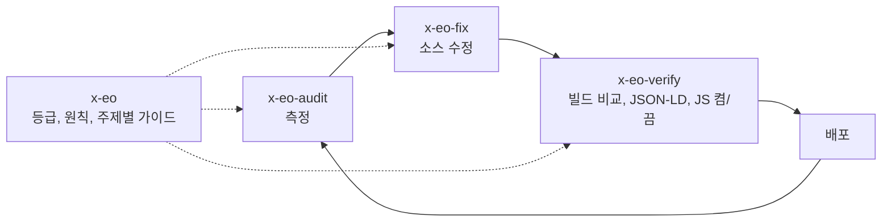

# x-eo

검색엔진과 AI 답변 엔진(SEO, AEO, GEO) 관점에서 웹사이트를 점검하고, 찾은 문제를 고치고, 고친 뒤 다른 곳이
깨지지 않았는지 확인하는 Claude Code 스킬입니다. 모든 권고에 증거 등급을 붙이므로 점수가 올랐다는 사실을 방문자가
늘어난다는 근거로 오해하지 않습니다.

[English](README.md) · [프로젝트 페이지](https://jungrok5.github.io/x-eo/ko/)

## 증거 등급을 쓰는 이유

AI 검색 점검 도구는 0–100점과 할 일 목록을 돌려줍니다. 목록에는 세 종류의 권고가 섞여 있습니다. 검색엔진이 문서로
밝힌 동작(JavaScript 없이 크롤러가 본문을 읽는가), 그럴듯한 관행(질문형 소제목), 주요 엔진이 읽는다는 근거가 없는
관례(`llms.txt`, `/.well-known/ai.txt`)입니다. Google의 AI 최적화 안내(2026-07-10 갱신)는 Google 검색이 AI용 텍스트
파일과 특수 마크업을 무시한다고 밝힙니다. x-eo는 각 항목에 등급을 붙이고, 점수를 도구 기준과 Tier C 제외 기준으로
함께 보고합니다.

| 등급 | 뜻 | 예 | 처리 |
| --- | --- | --- | --- |
| A | 검색엔진 문서로 확인되거나 직접 관찰 가능 | HTTP 200, 원본 HTML의 본문, canonical, hreflang, 사이트맵, 검색 크롤러를 막지 않는 robots, 파싱되고 화면과 일치하는 JSON-LD | 먼저 수정 |
| B | 제3자 연구나 상관관계로만 뒷받침 | 답변형 문단, 최신성, 일관된 개체 이름과 `sameAs`, 자체 데이터 | 독자에게도 도움이 될 때 적용 |
| C | 사용 근거가 없는 관례 | `llms.txt`, `llms-full.txt`, `ai.txt`, `/ai/*.json`, WebMCP | 비용이 없을 때만 적용, 성과로 계산하지 않음 |
| SEC | 보안 항목 | 프롬프트 주입 경로, 노출된 비밀값 | 실제 쓰기 경로를 확인한 뒤 보고 |

## 스킬 4개와 작업 순서



| 스킬 | 스크립트와 파일 |
| --- | --- |
| `x-eo` | 증거 등급, 정직 원칙, 보고 양식. `references/`에 증거 기록, 함정 13개, 도구 검토, `korea.md`(네이버 서치어드바이저, Yeti·Daumoa 크롤러, 카카오톡 미리보기), [claude-seo](https://github.com/AgriciDaniel/claude-seo)(MIT)에서 가져온 주제별 가이드 12개 |
| `x-eo-audit` | `audit.sh`: [geo-optimizer-skill](https://github.com/Auriti-Labs/geo-optimizer-skill) 4.18.3을 임시 venv에서 실행, Tier C 포함·제외 점수, CI용 `--threshold`. `host-root-check.sh`: 호스트 루트의 robots·사이트맵·llms 파일. `site-sample.py`: 사이트맵 기준 N페이지 표본 검사. `ai-recall.mjs`: 검색이 연결된 AI API에 브랜드 이름이 없는 질문을 보내고 내 URL 인용 횟수를 집계 |
| `x-eo-fix` | `gen-robots.py`(크롤러별 정책, 전체 `Disallow` 생성 안 함), JSON-LD 템플릿, 하위 경로 사이트용 루트 파일, `html-to-llms-full.mjs`, `gen-ai-files.mjs`(Tier C), `indexnow.mjs` |
| `x-eo-verify` | `diff-builds.sh`(기준 커밋과 작업 트리를 각각 빌드해 바뀐 파일 목록 출력), `jsonld-lint.py`, `render-diff.mjs`(Playwright, JavaScript 켬·끔 비교), `local-audit.py`(자기 127.0.0.1 서버) |

## 설치

네 스킬은 서로 참조하므로 모두 복사합니다. 설치 스크립트, 훅, 백그라운드 에이전트는 없습니다.

```bash
git clone --depth 1 https://github.com/jungrok5/x-eo.git
mkdir -p ~/.claude/skills && cp -r x-eo/skills/* ~/.claude/skills/
```

한 프로젝트에만 쓰려면 그 프로젝트의 `.claude/skills/`에 복사합니다. `bash`, `git`, `python3` 3.10 이상이
필요합니다. `render-diff.mjs`는 `npm i playwright-core`와 `PLAYWRIGHT_CHROMIUM`에 지정한 Chromium 경로가 추가로
필요합니다. `ai-recall.mjs`는 `ANTHROPIC_API_KEY` 또는 `OPENAI_API_KEY`가 필요하며 질문과 엔진마다 검색 요청 1회
비용이 발생합니다.

설치 후 Claude Code에 `x-eo로 https://example.com 을 점검하고 Tier A 항목을 고친 뒤 검증해 줘`라고 요청합니다.

## 스크립트 직접 실행

```bash
S=x-eo/skills
bash    $S/x-eo-audit/scripts/audit.sh --threshold 80 https://example.com/
bash    $S/x-eo-audit/scripts/host-root-check.sh https://example.com/blog/
python3 $S/x-eo-audit/scripts/site-sample.py https://example.com/ --max 8
node    $S/x-eo-verify/scripts/render-diff.mjs https://example.com/
python3 $S/x-eo-verify/scripts/jsonld-lint.py ./dist --require WebSite --strict
python3 $S/x-eo-fix/scripts/gen-robots.py --sitemap https://example.com/sitemap.xml --out robots.txt
```

## 사례: 214개 언어 정적 사이트, 62점에서 90점

[examples/one-scroll-bible.md](examples/one-scroll-bible.md)에 점수 변화를 항목별로 기록했습니다. 오른 28점 중
12점은 Tier C입니다. Tier C를 빼면 52/76에서 68/76으로 올랐습니다. 효과를 측정할 수 있었던 변경은 한국어 루트
페이지의 사전 렌더링입니다. JavaScript 없이 보이는 본문이 렌더링된 화면의 11%에서 53%로 늘었고, JavaScript를 켠
화면의 DOM은 바이트 단위로 같았습니다.

## 한계

- `audit.sh`는 키워드 규칙으로 등급을 매깁니다. 등급이 틀릴 수 있으므로 항목 내용을 직접 확인합니다.
- 점수는 한 도구의 분류와 가중치를 따릅니다. 서로 다른 도구의 점수가 아니라 같은 도구, 같은 버전의 변경 전후를 비교합니다.
- `ai-recall.mjs`의 결과는 표본이며 비율이 아닙니다. 실행할 때마다 답이 달라지고 Perplexity는 지원하지 않습니다.
- `local-audit.py`는 geo-optimizer 내부를 수정하므로 업그레이드하면 동작하지 않을 수 있습니다. 그래서 버전을 고정합니다.
- `render-diff.mjs`의 50% 기준은 판단에 따른 값입니다.
- 리눅스에서만 시험했습니다. 증거 기록과 `korea.md`에는 작성 날짜가 있으므로 사용 전에 다시 확인합니다.

레포 구조 검사: `python3 tests/validate.py`

## 출처와 라이선스

MIT. `skills/x-eo/references/claude-seo/`의 주제별 가이드는 claude-seo(MIT)에서 가져왔고 출처는 같은 폴더의
`NOTICE.md`에 있습니다. 함께 검토한 도구와 각 도구의 장단점은 `references/tools.md`에 있습니다.
