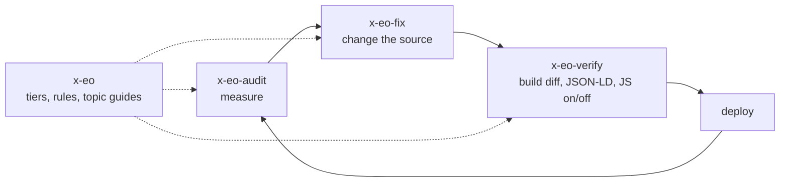

# x-eo

Agent skills for Claude Code that audit a website for search engines and AI answer engines (SEO, AEO, GEO),
fix what they find, and check that the fix broke nothing. Every recommendation carries an evidence tier, so a
higher score is never mistaken for proof that more people will find the site.

[한국어](README.ko.md) · [Project page](https://jungrok5.github.io/x-eo/)

## Why evidence tiers

AI search checkers return a 0–100 score and a to-do list. The list mixes three kinds of advice: documented
behavior (can a crawler read the page without JavaScript?), plausible practice (question-shaped headings), and
conventions that no major engine has been shown to read (`llms.txt`, `/.well-known/ai.txt`). Google's AI
optimization guide (updated 2026-07-10) says Google Search ignores AI text files and special markup. x-eo labels each
finding and reports the score twice: as the tool counts it, and without Tier C points.

| Tier | Meaning | Examples | Treatment |
| --- | --- | --- | --- |
| A | Documented by the engine or directly observable | HTTP 200, content in raw HTML, canonical, hreflang, sitemap, robots not blocking search crawlers, JSON-LD that parses and matches the page | Fix first |
| B | Supported only by third-party or correlational studies | Answer-shaped passages, freshness, consistent entity name and `sameAs`, original data | Do it when it also helps readers |
| C | Convention without demonstrated use | `llms.txt`, `llms-full.txt`, `ai.txt`, `/ai/*.json`, WebMCP | Only if free; never counted as a result |
| SEC | Security finding | Prompt-injection surface, exposed secrets | Confirm a real write path before reporting |

## Four skills, one loop



| Skill | Scripts and files |
| --- | --- |
| `x-eo` | Evidence tiers, honesty rules, report template. `references/`: evidence ledger, 13 pitfalls, tool review, `korea.md` (Naver Search Advisor, Yeti and Daumoa crawlers, KakaoTalk previews), and 12 topic guides vendored from [claude-seo](https://github.com/AgriciDaniel/claude-seo) (MIT) |
| `x-eo-audit` | `audit.sh`: [geo-optimizer-skill](https://github.com/Auriti-Labs/geo-optimizer-skill) 4.18.3 in a temporary venv, score with and without Tier C, `--threshold` for CI. `host-root-check.sh`: robots, sitemap and llms files at the host root. `site-sample.py`: a sitemap-driven sample of N pages. `ai-recall.mjs`: asks search-enabled AI APIs brand-free questions and counts citations of your URLs |
| `x-eo-fix` | `gen-robots.py` (per-bot policy, never a blanket `Disallow`), JSON-LD templates, root files for sites served under a sub-path, `html-to-llms-full.mjs`, `gen-ai-files.mjs` (Tier C), `indexnow.mjs` |
| `x-eo-verify` | `diff-builds.sh` (build the base and working tree, list changed files), `jsonld-lint.py`, `render-diff.mjs` (Playwright, JavaScript on and off), `local-audit.py` (your own 127.0.0.1 server) |

## Install

Copy all four skills; they reference each other. There is no installer, hook or background agent.

```bash
git clone --depth 1 https://github.com/jungrok5/x-eo.git
mkdir -p ~/.claude/skills && cp -r x-eo/skills/* ~/.claude/skills/
```

For one project only, copy into `.claude/skills/` in that project instead. Requirements: `bash`, `git`,
`python3` 3.10 or later. `render-diff.mjs` also needs `npm i playwright-core` and a Chromium path in
`PLAYWRIGHT_CHROMIUM`. `ai-recall.mjs` needs `ANTHROPIC_API_KEY` or `OPENAI_API_KEY` and costs one search-enabled
request per question and engine.

Then ask Claude Code: `Audit https://example.com with x-eo, fix the Tier A findings, and verify.`

## Run the scripts directly

```bash
S=x-eo/skills
bash    $S/x-eo-audit/scripts/audit.sh --threshold 80 https://example.com/
bash    $S/x-eo-audit/scripts/host-root-check.sh https://example.com/blog/
python3 $S/x-eo-audit/scripts/site-sample.py https://example.com/ --max 8
node    $S/x-eo-verify/scripts/render-diff.mjs https://example.com/
python3 $S/x-eo-verify/scripts/jsonld-lint.py ./dist --require WebSite --strict
python3 $S/x-eo-fix/scripts/gen-robots.py --sitemap https://example.com/sitemap.xml --out robots.txt
```

## Example: 214-language static site, 62 to 90

[examples/one-scroll-bible.md](examples/one-scroll-bible.md) records each point. 12 of the 28 points were Tier C.
Without them the score moved from 52/76 to 68/76. The change with measurable value was prerendering the Korean root
page: text visible without JavaScript rose from 11% to 53% of the rendered page, and the JavaScript-on DOM stayed
byte-identical.

## Limits

- `audit.sh` assigns tiers with keyword rules. A label can be wrong; read the finding.
- Scores come from one tool, with that author's categories and weights. Compare the same tool and version before
  and after a change, not different tools.
- `ai-recall.mjs` takes a sample, not a rate. Answers vary between runs, and Perplexity is not covered.
- `local-audit.py` patches geo-optimizer internals and can break on upgrade; the version is pinned for that reason.
- The 50% threshold in `render-diff.mjs` is a judgment call.
- Tested on Linux. The evidence ledger and `korea.md` are dated; check them again before relying on them.

Tests: `python3 tests/validate.py` (layout) and `python3 -m unittest discover -s tests` (behaviour of every script against a local fixture server; no network). Both run in CI.

## Credits and license

MIT. The topic guides in `skills/x-eo/references/claude-seo/` come from claude-seo (MIT); attribution is in
`NOTICE.md` there. `references/tools.md` records what other tools were reviewed and what each does well and poorly.
